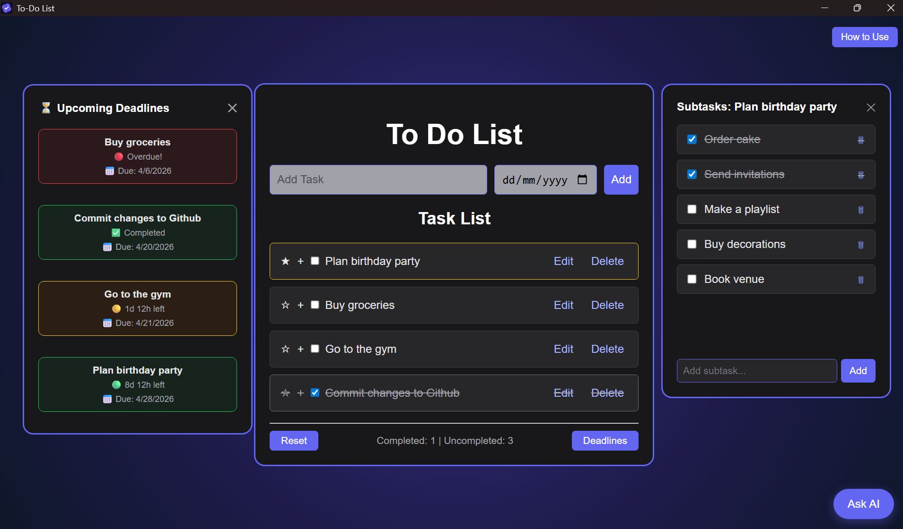

# ✅ To Do List - Desktop App

A feature-rich productivity desktop application built with **Electron**, **Node.js**, and **Express**. Manage your daily tasks efficiently with an integrated AI-powered chatbot assistant that understands your tasks and helps you plan and prioritize.

---

## 📸 Preview

---

## ⬇️ Download
Download the latest installer from the [Releases](../../releases) page — no code setup required. Just install and run!

---

## ✨ Features

- Add, edit, and delete tasks with a name and optional due date
- Edit tasks inline — change name and due date without a popup
- Star important tasks — highlighted with a yellow border
- Add subtasks to any task and track them individually
- Set due dates with live countdown timers and color-coded urgency — 🟢 plenty of time, 🟡 under 3 days, 🔴 overdue
- AI chatbot that has full awareness of your tasks, subtasks, deadlines, and completion status
- Tasks are saved locally and restored automatically on next launch
- Draggable subtask and deadline panels
- Built-in How to Use guide

---

## 🛠️ Tech Stack

| Technology | Purpose |
|---|---|
| Electron | Desktop app framework |
| Node.js + Express | Local backend server |
| HTML, CSS, JavaScript | Frontend UI |
| Groq API (LLaMA 3.3-70b) | AI chatbot |
| localStorage | Persistent task storage |

---

## 🚀 How to Run

1. Clone the repository
2. Run `npm install`
3. Get a free Groq API key at [console.groq.com](https://console.groq.com)
4. Open `server.js` and replace `YOUR_GROQ_API_KEY_HERE` with your actual key
5. Run `npm start`

---

## 🔧 How It Works

The app runs a local **Express server** in a separate child process alongside the Electron window. When you send a message to the chatbot, the frontend sends a request to `localhost:3000/chat`, which forwards it to the Groq API along with your full task list as context. The response is displayed in the chat window.

---

## 📁 Project Structure

| File | Purpose |
|---|---|
| main.js | Electron main process — creates window, manages server |
| server.js | Express backend — handles AI chatbot API calls |
| index.html | Main UI structure |
| script.js | Frontend logic — tasks, subtasks, deadlines, chat |
| style.css | All styling |
| package.json | Project config and dependencies |
